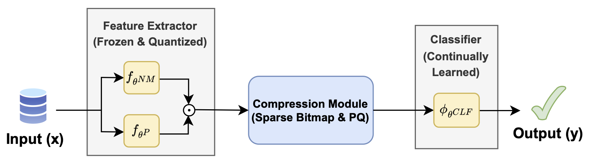
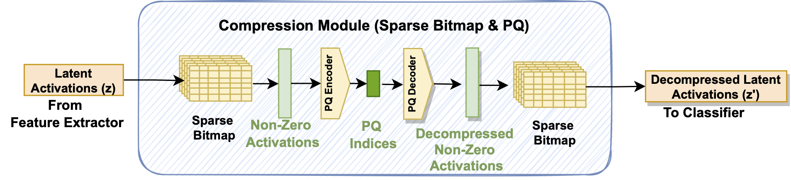
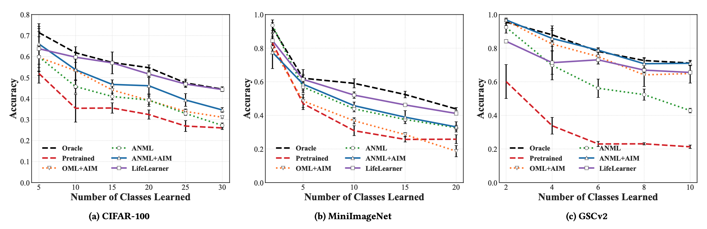
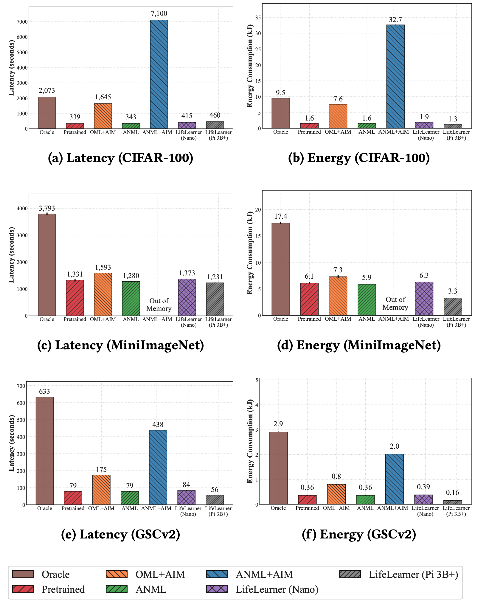
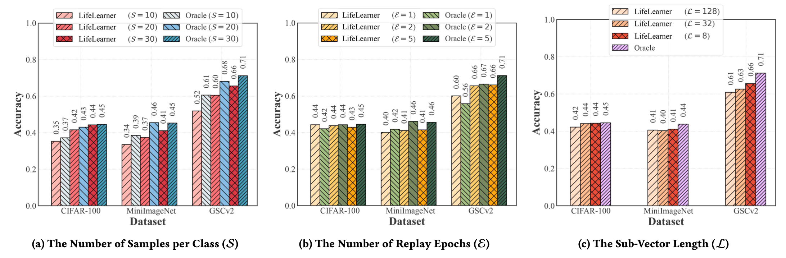

# LifeLearner: Hardware-Aware Meta Continual Learning System for Embedded Computing Platforms

This repository is the official implementation of [LifeLearner: Hardware-Aware Meta Continual Learning System for Embedded Computing Platforms](https://dl.acm.org/doi/10.1145/3625687.3625804), SenSys 2023.

### [[Paper Link](https://dl.acm.org/doi/10.1145/3625687.3625804)] | [[arXiv](https://arxiv.org/abs/2311.11420)] | [[Preprint](https://theyoungkwon.github.io/papers/articles/kwon_lifelearner_sensys23.pdf)] 

<p align="center">  </p>

**Figure: The system overview.** LifeLearner consists of the frozen/quantized feature extractor, the continually learned classifier, and the compression module based on sparse bitmap and Product Quantization (PQ). The compression module takes the feature extractor's outputs (activations) as inputs and compresses them to be saved as latent replay samples.

<p align="center">  </p>

**Figure: The overview of our compression module.** It consists of (1) a sparse bitmap to filter out zero from activations or to reconstruct decompressed activations from non-zero activations, (2) a PQ encoder that further compresses non-zero activations into PQ indices, and (3) a PQ decoder that decompresses PQ indices back into decompressed non-zero activations.


## News 

[19 Nov 2023] Our paper is released on [arXiv](https://arxiv.org/abs/2311.11420).

[19 Sep 2023] Our paper is accepted to [SenSys 2023](https://sensys.acm.org/2023/)!


## Overview

Recently, Meta-CL has been proposed to minimize the burden of manual labeling and system resources. However, the effectiveness of the existing methods, which are typically used for tasks involving images, when applying the algorithm to sequential time series data provided by auditory sensor systems, remains an unanswered question. 

To address this question, we present ***LifeLearner***, a comprehensive benchmark study that examines the performance of five representative Meta-CL approaches using three different network architectures on five datasets from image and audio data modalities. Furthermore, we developed an end-to-end Meta-CL benchmark framework on an edge device to evaluate on-device system overheads and investigate trade-offs between performance, computational costs, and memory footprint of the various Meta-CL methods. 


## Results

### The accuracy of the CL systems on the three datasets of two different modalities.



<!-- | CIFAR-100 | MiniImageNet | GSCv2 |
| :---: | :---: | :---: |
|  |  |  | -->


### The end-to-end latency and energy consumption of the baselines and LifeLearner to perform CL over all the given classes.




### The parameter analysis of LifeLearner for all the datasets according to the three parameters: (1) the number of samples per class, (2) the number of replay epochs, and (3) the sub-vector length.




## Setup
Setting up for this project involves installing dependencies and preparing the datasets. 

### Installing dependencies
To install all the dependencies, please run the following:

```
conda create -n lifelearner python=3.8
conda activate lifelearner
conda install pytorch torchvision torchaudio pytorch-cuda=12.1 -c pytorch -c nvidia
python -m pip install -r requirements.txt
```

### Preparing Dataset 

Please download all the datasets employed in our evaluation, namely, CIFAR-100, MiniImageNet, and GSCv2.

Then, create a symbolic link as following:
~~~
cd lifelearner
ln -s /your/dataset/directory/ data-link 
~~~
(optional) Make a folder for logging results
~~~
mkdir data/results
~~~


## Running LifeLearner

Below are training and testing commands. 

### Meta-Training
Below line will run the training code.
~~~
./meta-train.sh
~~~

### Meta-Testing
Below line will run the testing code.
~~~
./meta-test.sh
~~~


## Citation
If you find this repository useful in your research, please consider citing:
```
@inproceedings{kwon2023lifelearner,
    author = {Kwon, Young D. and Chauhan, Jagmohan and Jia, Hong and Venieris, Stylianos I. and Mascolo, Cecilia},
    title = {LifeLearner: Hardware-Aware Meta Continual Learning System for Embedded Computing Platforms},
    year = {2024},
    isbn = {9798400704147},
    publisher = {Association for Computing Machinery},
    address = {New York, NY, USA},
    url = {https://doi.org/10.1145/3625687.3625804},
    doi = {10.1145/3625687.3625804},
    booktitle = {Proceedings of the 21st ACM Conference on Embedded Networked Sensor Systems},
    pages = {138–151},
    numpages = {14},
    keywords = {continual learning, meta learning, on-device training, latent replay, product quantization, edge computing, microcontrollers},
    location = {Istanbul, Turkiye},
    series = {SenSys '23}
}
```


## Acknowledgements
This work is built upon the previous works. We thank @eugenelet for open-sourcing the repo [AIM](https://github.com/huang50213/AIM-Fewshot-Continual). Also, our implementation relies on the open-source library [Faiss](https://github.com/facebookresearch/faiss) from Facebook AI Research.
